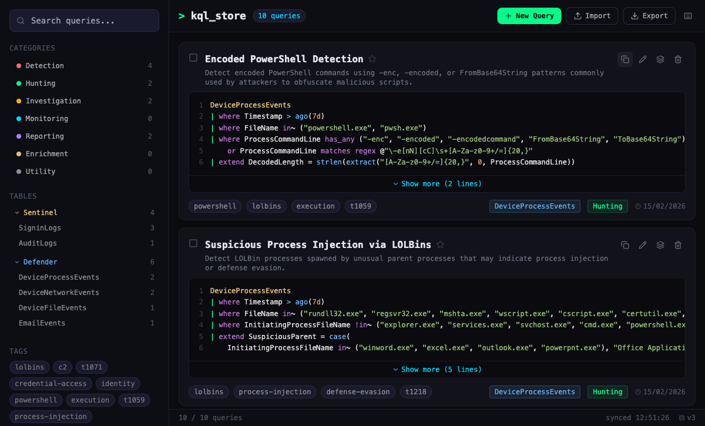

# KQL Store

A self-hosted manager for the KQL queries you have already written for Microsoft Sentinel and
Defender XDR. It gives them a home: a searchable, taggable, syntax-highlighted store that lives
on your own infrastructure instead of in a wiki page, a OneNote tab, or forty browser bookmarks.
**It is not a detection-content library.** The name misleads: KQL Store ships with zero queries,
no rule packs, no ATT&CK-mapped analytics and no upstream feed to sync from. It is an empty
cabinet, and everything in it will be something you or your team put there.



## Architecture

Two images, two Deployments. The SPA is bundled at image build time by esbuild and Tailwind and
served as static assets by nginx; nginx also reverse-proxies `/api/` to an Express service that
owns a SQLite database on a PersistentVolumeClaim. Nothing is fetched from a third-party origin
at runtime, which is what makes the strict Content-Security-Policy in `nginx.conf` possible.

```
                 Cloudflare Access   (authentication happens here, at the edge)
                          │
                          ▼
  ┌────────────────────────────────────────────┐
  │ Deployment: kqlstore          (2 replicas) │
  │   nginx :8080                              │
  │     /       → index.html, app.js, app.css  │  static bundle
  │     /api/   → proxy_pass ──────────────┐   │
  └────────────────────────────────────────┼───┘
                                           │  ClusterIP, NetworkPolicy-restricted
                                           ▼
  ┌────────────────────────────────────────────┐
  │ Deployment: kqlstore-api       (1 replica) │
  │   Express :3000 → better-sqlite3           │
  │                     /data/kqlstore.db      │
  └───────────────────────┬────────────────────┘
                          │
          ┌───────────────┴────────────────┐
          ▼                                ▼
  PVC kqlstore-api-data          CronJob kqlstore-api-backup
  (1Gi, ReadWriteOnce)           nightly → PVC kqlstore-api-backup
```

The API Deployment is single-replica with a `Recreate` strategy and **must never be scaled above
one**: the store is a single SQLite file on a ReadWriteOnce volume, which binds to one node and
tolerates exactly one writer. Scaling out means replacing SQLite, not adding replicas.

| Path | What it is |
| --- | --- |
| `src/` | The SPA — components, storage adapter, KQL highlighter, domain logic |
| `index.html` | Entry point; loads the bundle, no inline script |
| `nginx.conf` | Static serving, `/api/` proxy, CSP and security headers |
| `Dockerfile` | esbuild + Tailwind build stage → `nginx:1.27-alpine` runtime |
| `api/` | Express app, SQLite schema, request validation, `api/test/` |
| `k8s/` | Namespace, Deployments, Services, PVCs, NetworkPolicies, backup CronJob |
| `docs/local/` | Configuration used only when running outside Kubernetes |
| `docs/maintenance/` | Manifests applied by hand for backup and restore, never deployed |
| `.github/` | CI, issue and pull-request templates |

## Quickstart with Docker

Build both images, then run them on a user-defined network so the frontend can resolve the API
by container name.

```bash
docker build -t kqlstore-api:local ./api
docker build -t kqlstore:local .

docker network create kqlstore-local
docker volume create kqlstore-data

docker run -d --name kqlstore-api-local \
  --network kqlstore-local -p 3000:3000 \
  -v kqlstore-data:/data \
  kqlstore-api:local

docker run -d --name kqlstore-web-local \
  --network kqlstore-local -p 8080:8080 \
  -v "$PWD/docs/local/nginx.local.conf:/etc/nginx/nginx.conf:ro" \
  kqlstore:local
```

The mounted config is not optional. The shipped `nginx.conf` proxies to
`kqlstore-api.kqlstore.svc.cluster.local` and resolves that name once at startup; off-cluster the
name does not exist, so nginx aborts with `host not found in upstream` and the container never
serves a byte. `docs/local/nginx.local.conf` is the same configuration — same CSP, same headers —
with the upstream pointed at the API's container name.

Check it came up:

```bash
curl -s http://localhost:8080/api/health
# {"status":"ok","writable":true,"timestamp":"..."}
```

Then open <http://localhost:8080/>.

Tear down:

```bash
docker rm -f kqlstore-web-local kqlstore-api-local
docker network rm kqlstore-local
docker volume rm kqlstore-data      # this destroys the query store
```

## Deploy to Kubernetes

The manifests reference `192.168.1.76:5001`, a registry on the maintainer's own network. **Change
the image references to your own registry before applying** — in `k8s/deployment.yaml`,
`k8s/api-deployment.yaml` and `k8s/api-backup-cronjob.yaml`, which deliberately runs the same
image as the API.

```bash
docker build -t <your-registry>/kqlstore:latest .
docker build -t <your-registry>/kqlstore-api:latest ./api
docker push <your-registry>/kqlstore:latest
docker push <your-registry>/kqlstore-api:latest
```

Deploy with kustomize. `k8s/kustomization.yaml` exists precisely so a first apply converges:
kustomize sorts its output by kind, which puts the Namespace and the claims ahead of the
workloads that need them.

```bash
kubectl apply -k k8s/
kubectl -n kqlstore rollout status deploy/kqlstore-api
kubectl -n kqlstore rollout status deploy/kqlstore
```

Do not use `kubectl apply -f k8s/`. It fails twice over: it tries to submit
`kustomization.yaml` itself as a resource (`no matches for kind "Kustomization"`), and it reads
the rest of the directory in lexical order, so on a clean cluster `api-backup-cronjob.yaml` is
admitted before `namespace.yaml` has created the namespace and everything after it fails with
`namespaces "kqlstore" not found`.

Both PVCs request `storageClassName: local-path`. Change them in `k8s/api-pvc.yaml` and
`k8s/api-backup-pvc.yaml` if your cluster provisions storage differently, or the claims sit
`Pending` forever and the API pod never schedules.

There is no Ingress in this repository, by design. **Cloudflare Access fronts the application and
performs all user authentication at the edge**; the API itself has no authentication. See
[SECURITY.md](SECURITY.md) for why, and for the obligation that comes with it. Expose
`svc/kqlstore` through whatever tunnel or ingress your Access policy covers, and nothing else.

`k8s/api-networkpolicy.yaml` admits only the frontend pods to the API and denies the API all
egress; the frontend may reach the API and kube-dns and nothing more. The backup Job carries its
own deny-all policy alongside the CronJob.

## Data model

SQLite on the PVC is the source of truth. `localStorage` (key `kql-store:data`) is a cache only:
it makes the first paint instant and keeps the UI readable if the API is briefly unavailable, but
every mutation goes to the API and the API's response is what wins on the next load. Clearing
site data loses nothing.

The schema is created and migrated by `api/db.js`:

```sql
CREATE TABLE IF NOT EXISTS queries (
  id          TEXT PRIMARY KEY,
  name        TEXT NOT NULL,
  query       TEXT NOT NULL,
  description TEXT DEFAULT '',
  category    TEXT DEFAULT 'Utility',
  table_name  TEXT DEFAULT '',
  tags        TEXT DEFAULT '[]',      -- JSON array of strings
  favorite    INTEGER DEFAULT 0,      -- 0 | 1
  usage_count INTEGER NOT NULL DEFAULT 0,
  created     TEXT NOT NULL,          -- ISO 8601
  updated     TEXT NOT NULL           -- ISO 8601
);
```

`category` is constrained by the API rather than the database, to one of Detection, Hunting,
Investigation, Monitoring, Reporting, Enrichment or Utility. Field bounds live in
`api/validate.js`: name 200 characters, query 50 000, description 1 000, table 200, up to 20 tags
of 50 characters each, 1 000 items per import and a maximum page size of 1 000 on
`GET /api/queries?limit=&offset=`.

### Backups

`k8s/api-backup-cronjob.yaml` runs a nightly online backup at 03:17 Europe/London, keeping 14
days on a separate `kqlstore-api-backup` claim. Each run takes a consistent snapshot through
SQLite's online backup API, takes the copy out of WAL mode so it is one self-contained file,
verifies it with `integrity_check` and a row count, and only then prunes anything older than the
retention window.

```bash
kubectl -n kqlstore get cronjob kqlstore-api-backup
kubectl -n kqlstore create job --from=cronjob/kqlstore-api-backup backup-now
kubectl -n kqlstore logs job/backup-now
```

**Those backups do not leave the node.** `local-path` is node-local storage and the CronJob is
pinned to the API's node, so both copies share one disk and one machine. It protects you against
a mistake, not against hardware. Pull them somewhere else on a schedule, using the maintenance pod
in `docs/maintenance/` — the API pod does not mount the backup claim, and the CronJob's own pods
exit too quickly to copy from:

```bash
kubectl apply -f docs/maintenance/backup-shell.yaml
kubectl -n kqlstore wait --for=condition=ready pod/kqlstore-maint --timeout=120s
kubectl -n kqlstore cp kqlstore-maint:/backup ./kqlstore-backups
kubectl -n kqlstore delete pod kqlstore-maint
```

For a portable, human-readable copy, use the export endpoint instead — it emits the same schema v3
JSON that the app's own Export button produces and its Import accepts. It runs from a frontend pod
because the NetworkPolicy admits nothing else to the API:

```bash
kubectl -n kqlstore exec deploy/kqlstore -- \
  curl -s http://kqlstore-api:3000/api/queries/export \
  > kqlstore-export-$(date -I).json
```

This is the backup to keep in version control: it survives schema changes and re-imports into an
empty instance.

If you ever take a file-level copy by hand, do not simply copy `kqlstore.db`. The database runs in
WAL mode, so **copying that file on its own gives you an empty database** — the committed rows are
still in the `-wal` sidecar, and the failure is silent: you get a valid SQLite file with no
`queries` table in it. Use `VACUUM INTO`, which writes one consistent file while the API carries
on serving:

```bash
kubectl -n kqlstore exec deploy/kqlstore-api -- node -e "
  const Database = require('/app/node_modules/better-sqlite3');
  const db = new Database(process.env.DB_PATH || '/data/kqlstore.db', { readonly: true });
  db.prepare('VACUUM INTO ?').run('/data/manual-backup.db');
"
```

`/data` is the only writable path in that pod — the root filesystem is read-only — so the
temporary file has to live beside the database. Delete it afterwards.

### Restoring

Restoring the JSON export needs no downtime: use the app's Import button, or POST the file to
`/api/queries/import`. The default mode is `insert`, which is `INSERT OR IGNORE` keyed on `id` and
will not touch a query that already exists; `{"mode": "upsert", "queries": [...]}` overwrites a
stored row when the incoming one is newer. Either way the response accounts for every item —
`total`, `imported`, `inserted`, `updated`, `skippedOlder`, `skippedExisting`, a per-item
`results` array and `rejected`, in which each rejection carries its index and its reason rather
than being silently dropped.

Restoring a database file does need downtime, and the `-wal`/`-shm` sidecars must be deleted along
with the old database or SQLite replays them over your restored copy. The same maintenance pod
mounts both claims:

```bash
kubectl apply -f docs/maintenance/backup-shell.yaml
kubectl -n kqlstore wait --for=condition=ready pod/kqlstore-maint --timeout=120s
kubectl -n kqlstore exec kqlstore-maint -- ls /backup

kubectl -n kqlstore scale deploy/kqlstore-api --replicas=0
kubectl -n kqlstore wait --for=delete pod -l app=kqlstore-api --timeout=120s
kubectl -n kqlstore exec kqlstore-maint -- sh -c '
  rm -f /data/kqlstore.db /data/kqlstore.db-wal /data/kqlstore.db-shm &&
  cp /backup/kqlstore-YYYY-MM-DDTHH-MM-SSZ.db /data/kqlstore.db'
kubectl -n kqlstore scale deploy/kqlstore-api --replicas=1
kubectl -n kqlstore rollout status deploy/kqlstore-api

kubectl -n kqlstore delete pod kqlstore-maint
```

Scaling to zero first is not optional: two processes with the same SQLite file open, one of them
replacing it underneath the other, is how a store gets corrupted.

## Configuration

Every environment variable the API code reads. All are optional; the defaults are what the shipped
manifests run with.

| Variable | Default | Read by | Meaning |
| --- | --- | --- | --- |
| `DB_PATH` | `/data/kqlstore.db` | `api/db.js` | SQLite file path; the parent directory is created if missing. Must be on the PVC — anywhere else and the store is lost on restart, because the root filesystem is read-only. |
| `PORT` | `3000` | `api/server.js` | TCP port the API listens on. Changing it means changing the Service, the probes and nginx's `proxy_pass` upstream as well. |
| `CORS_ORIGIN` | *(unset)* | `api/app.js` | Comma-separated list of permitted origins. When unset the CORS middleware is not mounted at all, which is correct for the shipped topology where nginx makes the browser same-origin. Set it only for split-origin development. |
| `API_TOKEN` | *(unset)* | `api/app.js` | Optional shared-secret bearer token on `/api/queries`; `/api/health` stays exempt so kubelet probes work. **Deliberately unset** — Cloudflare Access is the authentication layer. Setting it without also making nginx inject the header locks the SPA out entirely, because the browser sends no `Authorization` header. See the comment in `k8s/api-deployment.yaml`. |
| `HEALTH_WRITE_TTL_MS` | `30000` | `api/routes/health.js` | How long a writability result is cached. The health check writes one row to prove the PVC is not full or read-only; this stops a 10-second probe interval from costing a WAL frame per probe. |

The backup CronJob reads three more: `DB_PATH`, `BACKUP_DIR` (`/backup`) and `RETENTION_DAYS`
(`14`). The API Deployment and that CronJob also set `NODE_OPTIONS=--max-old-space-size=96`, which
is not application configuration but a necessity — V8 does not derive its heap ceiling from the
cgroup limit, so without it the pod is OOMKilled instead of collecting. Raise it and the memory
limit together or neither. The frontend Deployment has no equivalent: it runs nginx, and no Node
process survives past its image build.

## Limitations

Stated plainly, so none of it is a surprise later.

- **No query validation.** KQL is never parsed. A query that will not run in Sentinel saves
  perfectly happily; the highlighter colours tokens, it does not check them.
- **No MITRE ATT&CK metadata.** No technique IDs, no tactic mapping, no coverage view. Tags are
  free text and that is the whole taxonomy.
- **No Sentinel or Defender export.** Export produces this application's own JSON — not an
  analytics-rule ARM template, not a detection YAML, not anything a workspace will ingest.
  Getting a query into production is still copy and paste.
- **No connection to Microsoft at all.** Nothing is fetched from a workspace and nothing is
  pushed to one. It is an offline catalogue.
- **No attribution or audit trail.** The schema has no author column and the server records no
  history. Behind Access you know who *can* reach the app, not who changed what.
- **Single writer.** One API replica on a ReadWriteOnce volume, and it must stay that way.
- **Backups are node-local by default.** The nightly CronJob protects you from mistakes, not from
  losing the node. Copying them off the box is left to you.

## Licence

Licensed under the **GNU Affero General Public License v3.0 only** — see [LICENSE](LICENSE).

AGPL rather than GPL because this is network-served software, which is precisely what AGPL
section 13 was written for: run a modified version and let others use it over a network, and they
are entitled to your source. That obligation is the point. Self-hosting a tool that holds your
detection logic should not be a route to someone else taking it private.

## Contributing and security

- [CONTRIBUTING.md](CONTRIBUTING.md) — running it locally, tests, commit convention, code style.
- [SECURITY.md](SECURITY.md) — reporting a vulnerability, and the deployment's security posture.
- [CHANGELOG.md](CHANGELOG.md) — what changed and when.
